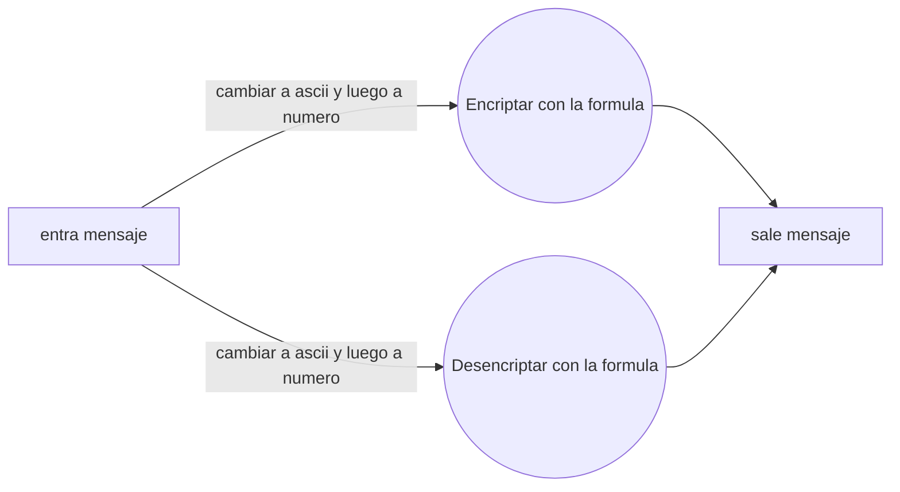

# Proyecto Sprint 1 y 2 *Cifrado Cesar*

## ¿Qué es?

El **cifrado César** también conocido como cifrado por desplazamiento, es un tipo de cifrado por sustitución en el que una letra en el texto original es reemplazada por otra letra que se encuentra un número fijo de posiciones más adelante en el alfabeto.

# Usuario
**Cliente modelo:**
 - Patricia Juarez es una chica de 23 años que busca tener contraseñas más seguras para su computadora y redes sociales pues trabaja como antropóloga y en ocasiones maneja información sensible en sus encuestas, además de que en una ocasión uno de sus exnovios consiguió sus contraseñas y a pesar de que ya las cambio le preocupa bastante que esa situación se repita.
 - Gracias a *ENCRYPTOR* puede controlar a quien le da información personal y se siente más segura pues sabe que sus contraseñas no son fáciles de averiguar.

**Investigación:**
Realice varias encuestas y me di cuenta de que el sector más interesado en mi webApp eran mujeres en sus veintes que buscaban una mayor seguridad al crear contraseñas o cuidar su información personal puesto que varias habían sufrido situaciones de acoso cibernético y querían tener más control sobre los datos sensibles que compartían.

# UX/UI
El usuario puede ingresar el mensaje que guste con números, mayúsculas, minúsculas, espacios, números y además puede elegir número de saltos que desee.

**Bocetos**
En un principio las usuarias que lo usaron estaban confundidas después de la parte de la encriptación y sugirieron dos cajas para encriptar y desencriptar.

Tambien cambie los inputs a textarea para que pudiesen añadir más texto.

Hice bordes redondeados en las figuras para simular las formas de las aplicaciones con las que los usuarios se sienten más acostumbrados.
Los colores que utilice fueron en su mayoría rosas y grises pues fueron los más aceptados por las 5 usuarias de prueba además de por otro grupo de 5 usuarios de 14 años.
Finalmente coloqué una descripción para ayudar a entender mejor la funcionalidad y una imágen de portada.

**Muestra final** 
Le puse el nombre de encryptor pues era el mas fácil de recordar y entender de los dos finalistas que eran ENCRYPTOR y CRIPTATO

# Funcionalidad

## Objetivos
 - Usar el offset que el usuario decida para decifrar y cifrar
 - Recibir un mensaje, convertirlo a ASCII, cifrarlo y convertirlo en *String*
 -  Recibir un mensaje, convertirlo a ASCII, decifrarlo y convertirlo en *String*
***

## Formulas
**Cifrado**

 - Mayúsculas: *((no_ascii  -  65  +  offset1) %  26  +  65)*
 - Minúsculas: *((no_ascii  -  48  +  offset1) %  10  +  48)*
 - Números: *((no_ascii  -  97  +  offset1) %  26  +  97)*

**Decifrado**
- Mayúsculas: *((no_ascii  -  65  -  offset1) %  26  +  65)*
 - Minúsculas: *((no_ascii  -  48  -  offset1) %  10  +  48)*
 - Números: *((no_ascii  -  97  -  offset1) %  26  +  97)*
***
Diagrama del cifrado Cesar:

